# Для начала скачаем Android Studio с [официального сайта](https://developer.android.com/studio) и установим
***

### Последняя stable версия - это [Hedgehog](https://developer.android.com/studio/releases), в которой произошел глобальный редизайн.
### Однако по ней, на текущий момент, не так много информаци, потому советуем скачать предыдущую(Giraffe) из [архива](https://developer.android.com/studio/archive) 

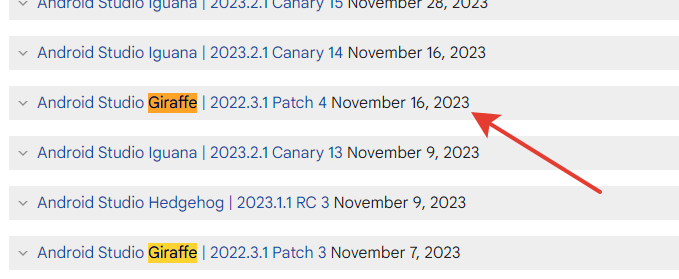

### 1) После установки создадим пробный проект
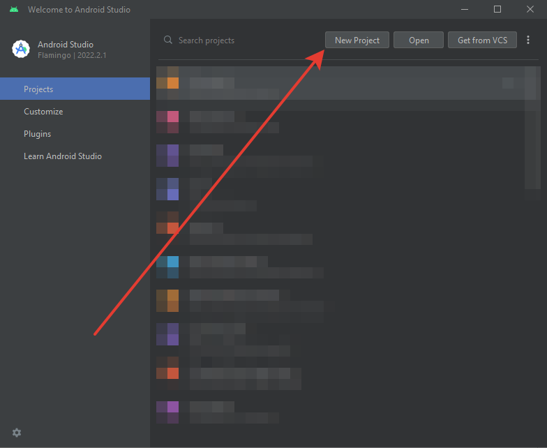
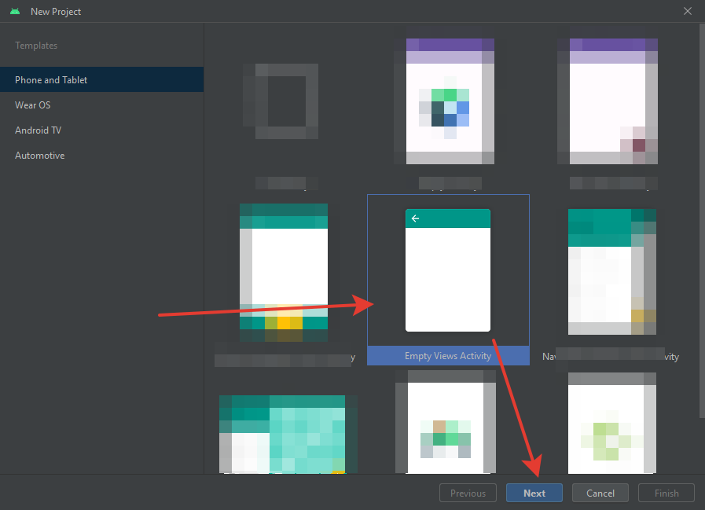
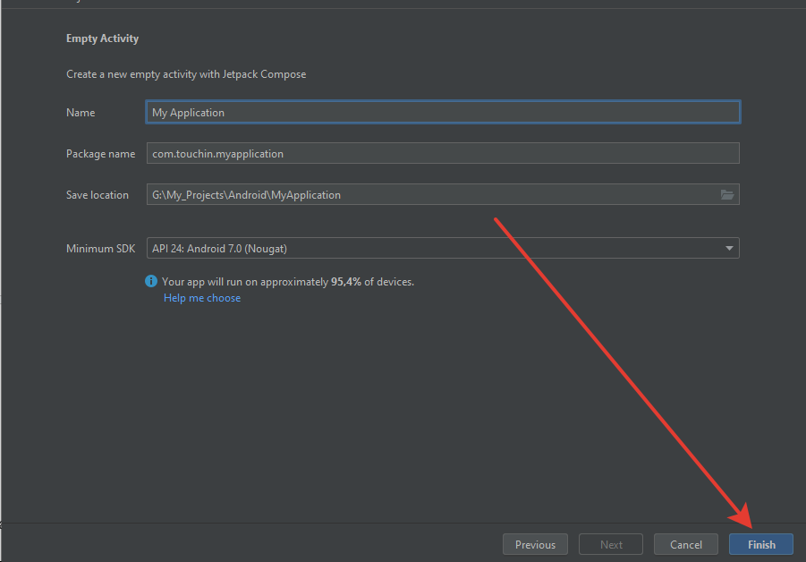

### 2) Дождемся успешной синхронизации
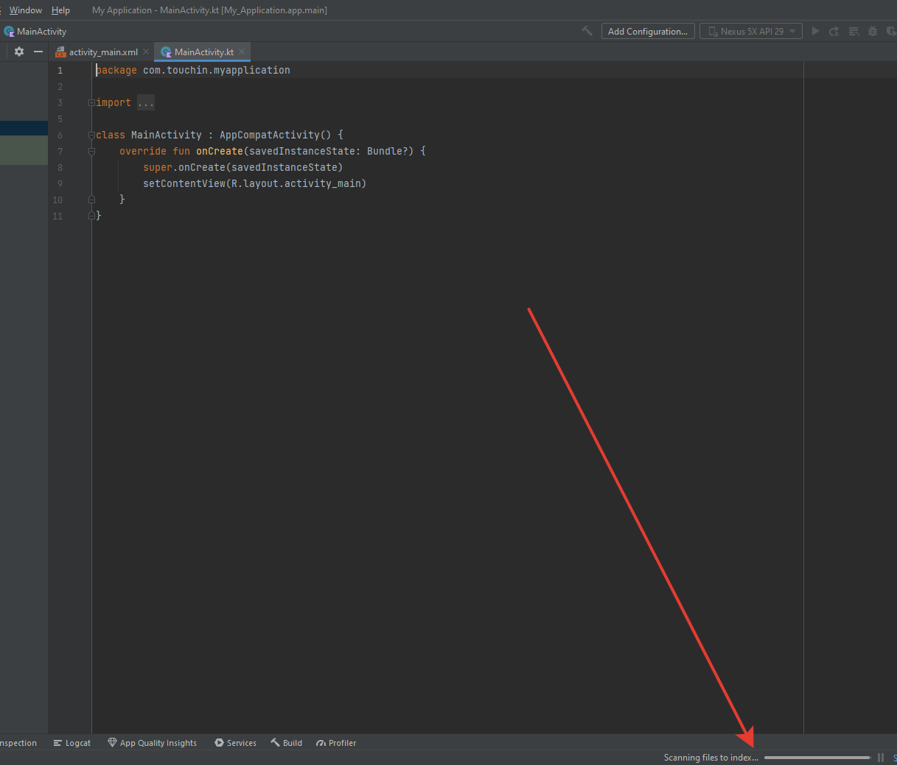

### 3) Теперь создадим эмулятор на котором запустим тестовое приложение. Справа в вертикальной полосе будет вкладка Device Manager. Она нам и нужна.
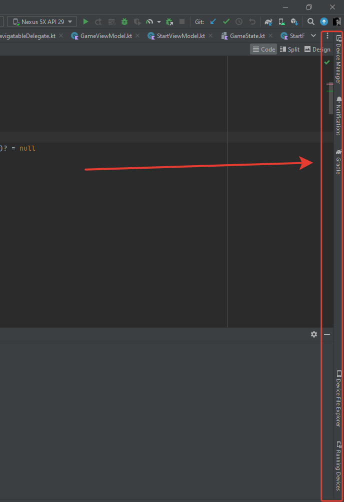

### 4) Создадим девайс
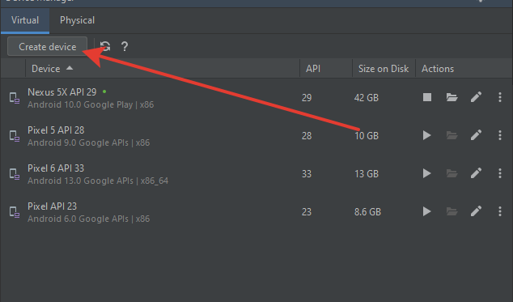

### 5) Cоветуем выбрать Pixel с PlayStore
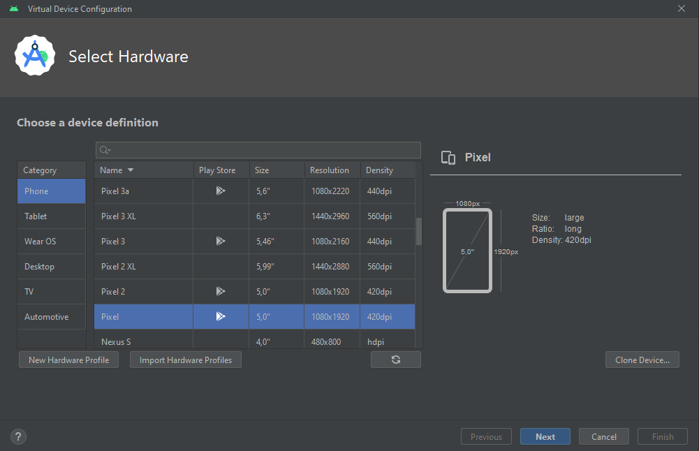

### 6) Далее необходимо установить версию Android, пусть будет 11 версия (R)
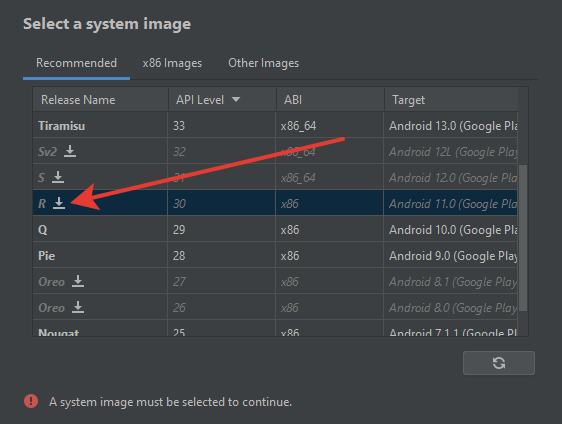
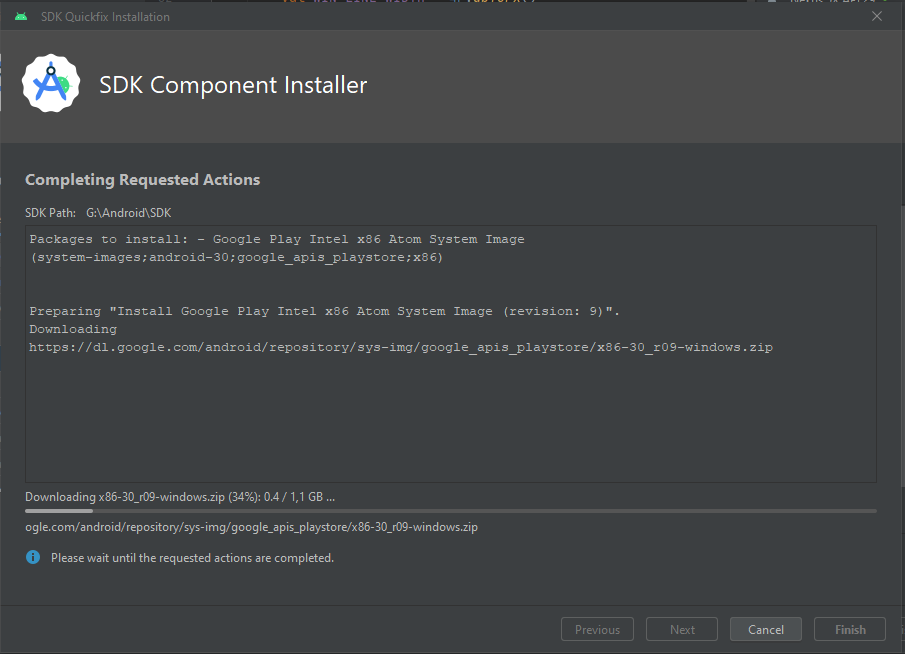

### 7) После того как скачается необходимо выбрать только что скачанную версию, прейти дальше и кнопкой Finish создать эмулятор.
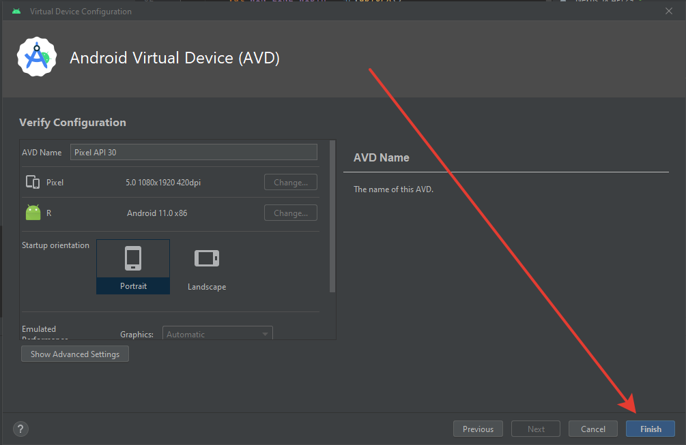

### 8) Нажимаем запустить
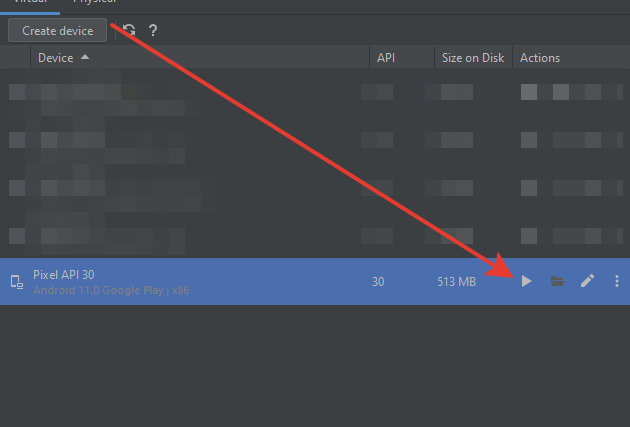

### 9) И при появлении эмулятора нажмите кнопку включения
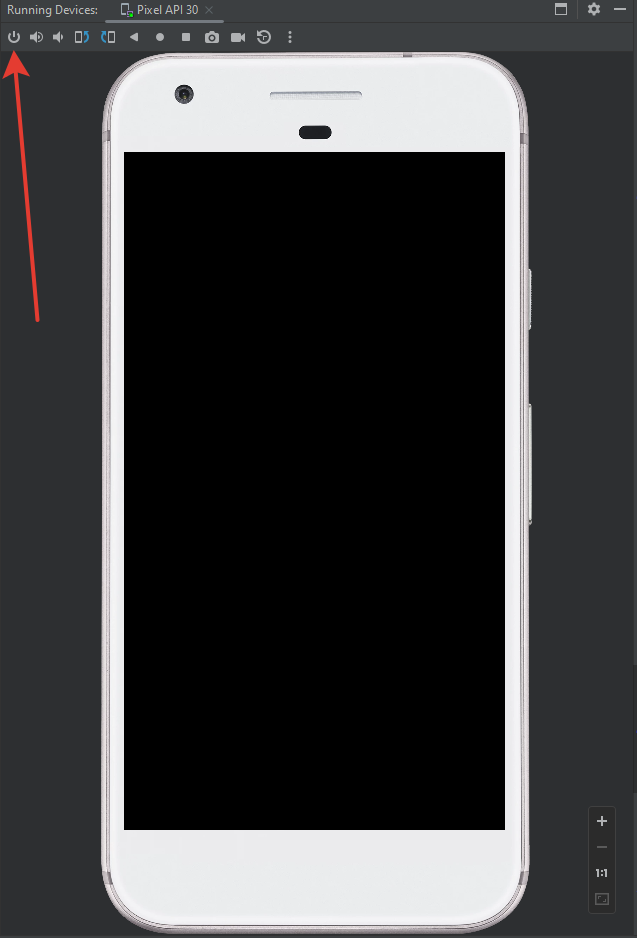

### 10) Ну и наконец запустим проект.
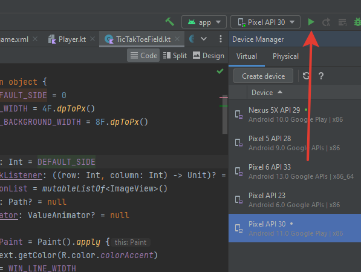
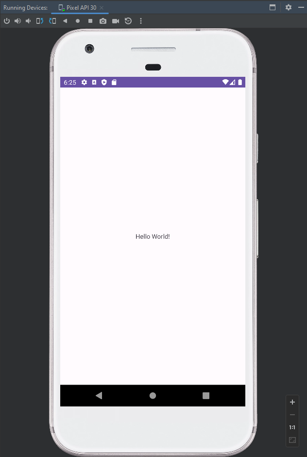
